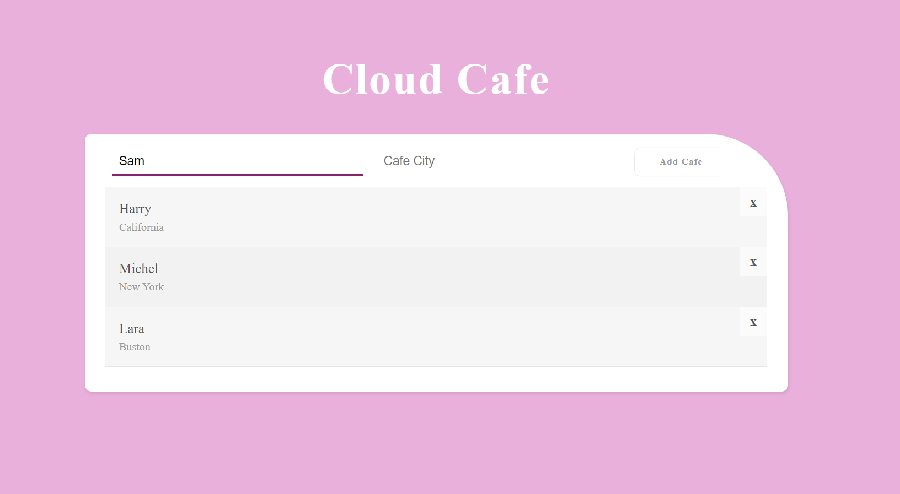

# firebase_basics

Here is the basic project which was built using html,css and java script and here we have done firebase as backend.

**Steps to download and run this application**

 1. Download or clone this code to your local system.
 2. Download the visual studio code and install live server plugin.
 3. Go to firebase and create id and then create collection and documents.
 4. Go to index.html and right click and select "run on live server".
 5. Then you will be able to see the UI where you can add and delete the records.

**Demo**

